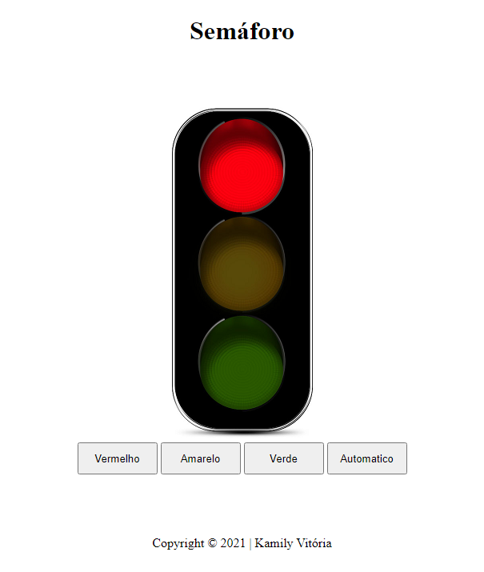

# Semaforo

Projeto criado com objetivo didático para as aulas de PWFE do curso de Desenvolvimento de Sistemas do [SENAI Jandira](https://jandira.sp.senai.br/), sobre orientação do professor Fernando Leonid.

O projeto consiste em criar um semaforo que tenha quatro ações:
* Ligar o verde
* Ligar o vermelho
* Ligar o amarelo
* Automático

Todo o código foi construído seguindo as boas práticas, com responsabilidade única e funções puras.

